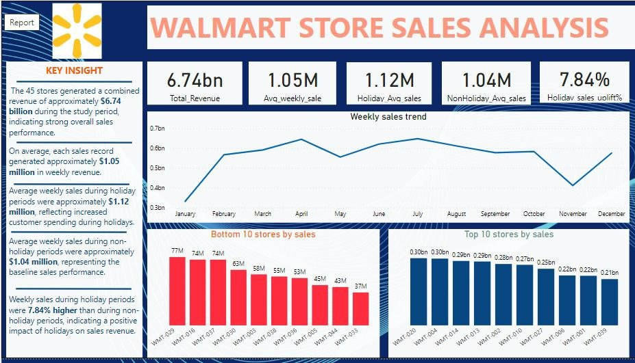

# 🛒 Walmart Store Sales Performance & Holiday Impact Analysis

## 📌 Project Overview

This project analyzes weekly sales performance across **45 Walmart stores** by examining the impact of holiday markdown events and key economic factors, including:

* 🛍️ Holiday vs. non-holiday periods
* 🌡️ Temperature
* ⛽ Fuel prices
* 👥 Unemployment rate

The objective is to identify the key drivers of store performance and uncover patterns that can support better business decisions.

---

## 📈 Dashboard Highlights

* Holiday vs. Non-Holiday Sales Comparison
* Store Performance Ranking
* Weekly Sales Trend
* Correlation Analysis
* KPI Cards
* Interactive Filters and Slicers

## 📷 Dashboard Preview

## 📊 Key Insights

### 🎄 Holiday vs. Non-Holiday Average Sales

The analysis shows that **average weekly sales during holiday periods ($1.12 million)** were noticeably higher than **non-holiday periods ($1.04 million)**.

* **Holiday Average Sales:** **$1.12M**
* **Non-Holiday Average Sales:** **$1.04M**
* **Average Increase:** **7.84%**

**Insight:** Holiday periods positively influenced sales performance, indicating increased customer spending during festive seasons.

---

### 🏪 Sales Performance by Store

Sales performance varied significantly across the **45 Walmart stores**.

#### Top Performing Stores

| Rank | Store    | Total Sales |
| ---- | -------- | ----------: |
| 🥇 1 | Store 20 | **$301.4M** |
| 🥈 2 | Store 4  | **$299.5M** |
| 🥉 3 | Store 14 | **$289.0M** |

#### Lowest Performing Stores

| Rank | Store    |     Total Sales |
| ---- | -------- | --------------: |
| 1    | Store 33 |      **$37.2M** |
| 2    | Store 44 | Low Performance |
| 3    | Store 5  | Low Performance |

### Overall Sales

* **Total Weekly Sales Across All Stores:** **Approximately $6.74 Billion**

**Insight:** The substantial variation in sales across stores suggests that factors such as **store location, market size, customer demand, and local economic conditions** play important roles in determining store performance.

---

## 📈 Correlation Analysis

### Weekly Sales vs. Temperature

**Correlation Coefficient (r = -0.064)**

* Very weak negative correlation.
* Temperature has almost **no measurable effect** on weekly sales.
* As temperature increases, weekly sales decrease slightly, but the relationship is negligible.

---

### Weekly Sales vs. Fuel Price

**Correlation Coefficient (r = 0.009)**

* Correlation is virtually zero.
* Fuel price changes have **no meaningful linear relationship** with weekly sales.
* Fuel price is unlikely to be a useful predictor of sales performance.

---

### Temperature vs. Fuel Price

**Correlation Coefficient (r = 0.145)**

* Very weak positive correlation.
* Higher temperatures are associated with slightly higher fuel prices.
* The relationship is weak and not practically significant.

---

## 📌 Overall Conclusion

The analysis indicates that:

* ✅ Holiday periods significantly increase weekly sales.
* ✅ Store performance varies considerably across locations.
* ✅ Temperature has little influence on weekly sales.
* ✅ Fuel prices have virtually no effect on sales performance.
* ✅ Other business factors—such as promotions, store size, customer demographics, and regional demand—are likely stronger drivers of weekly sales than temperature or fuel prices.

---

## 🛠️ Tools Used

* **Power BI** – Data visualization and dashboard development
* **Microsoft Excel** – Data cleaning and preparation
* **DAX** – Measures and calculated columns
* **Power Query** – Data transformation

---
